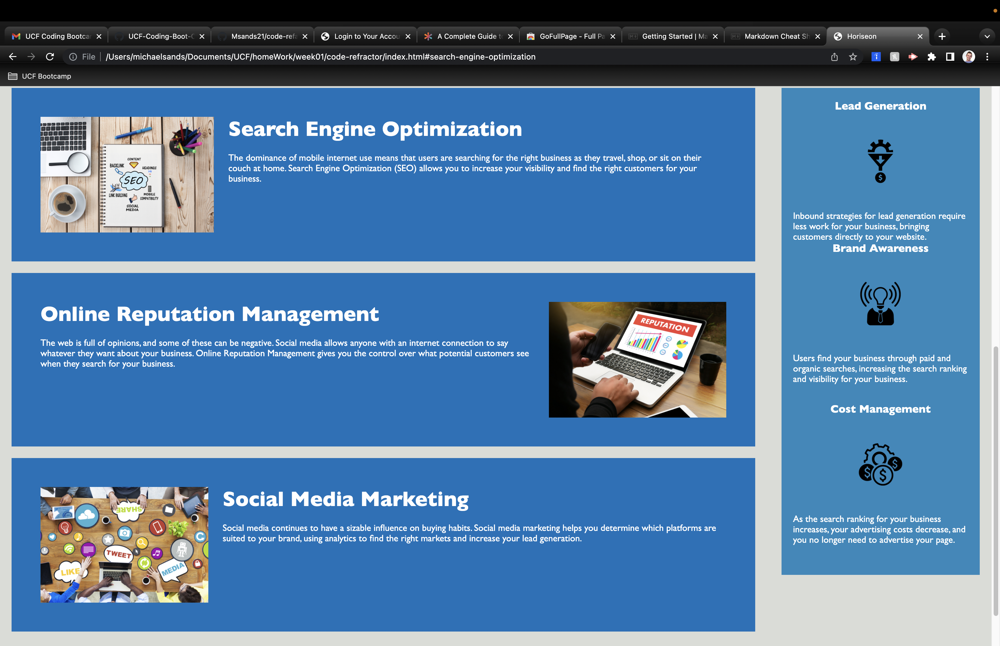
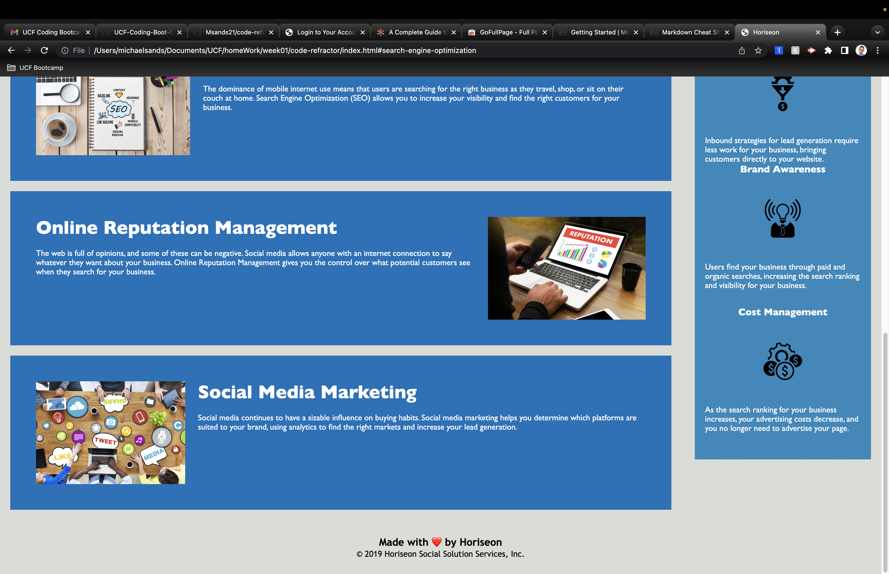

# **code-refactor**
Code refactor homework for UCF bootcamp

**Project Decscription**
In this project, I cleaned up HTML and CSS code by renaming div classes to its respective semantic tags. This heavily decluttered the CSS stylesheet and made the index.html more organized. 

## Project Location
Repo Link: [RepoLink] (https://github.com/Msands21/code-refactor)

Live Link: [LiveLink] (https://msands21.github.io/code-refactor/)

### Contact Info
mikesands94@gmail.com

#### Project Example

